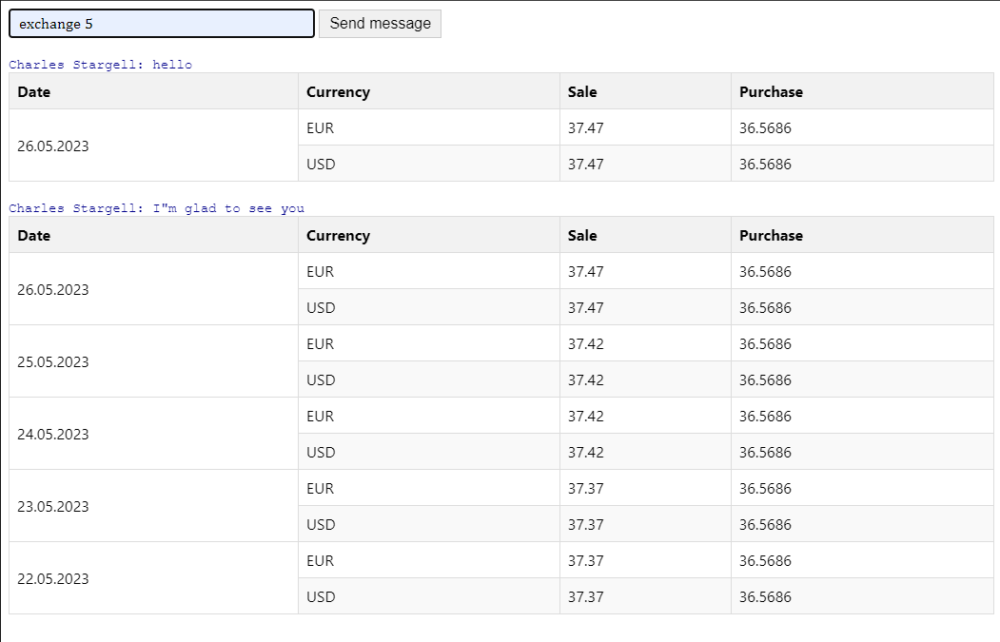

# Домашнє завдання #5 (Додаткова частина)

Цей проект є веб-додатком, який демонструє використання `WebSocket` для отримання та відображення даних про курси валют. Він складається з серверної частини, написаної на мові програмування `Python`, та клієнтської частини, написаної на `JavaScript`, яка відображає отримані дані у вигляді таблиці.

## Серверна частина

Серверна частина написана з використанням мови програмування `Python`. Вона використовує бібліотеку `WebSocket` для створення `WebSocket-`сервера, який відповідає на запити від клієнта та надсилає дані про курси валют. Дані отримуються зовнішнього `API` [Приватбанку](https://api.privatbank.ua/#p24/exchangeArchive), та передаються клієнту у форматі JSON.

### Для активації сервера, треба встановити залежності

```bash
[packages]
aiohttp = "*"
aiopath = "*"
aiofile = "*"
websockets = "*"
names = "*"

[requires]
python_version = "3.10"
```

## Клієнтська частина

Клієнтська частина є веб-сторінкою, яка відображає таблицю з отриманими даними про курси валют. Вона використовує `JavaScript` та `WebSocket` для з'єднання з сервером та отримання оновлень даних. Користувач може вводити повідомлення у форму та надсилати їх на сервер через `WebSocket`.

- Для запиту курса валют в форму запиту можна записати ключове слово `exchange`, у вікні браузера буде відображена табличка по курсам валют `USD` та `EUR` на поточну дату.

- Якщо записати `exchange` та вказати кількість днів у вигляді числа: `exchange 5`, у вікні браузера буде відображена табличка по курсам валют `USD` та `EUR` задану кількість днів до поточної дати (включно)[^1].

- Якщо а написати довільну фразу, сервер згенерує фейкове ім'я і поверне його та фразу, що ми йому передали.

[^1]: При виконанні запиту можлива затримка в часі, при цьому взаємодія з сервером не блокується.

### Вигляд вікна браузера зображений на рисунку


